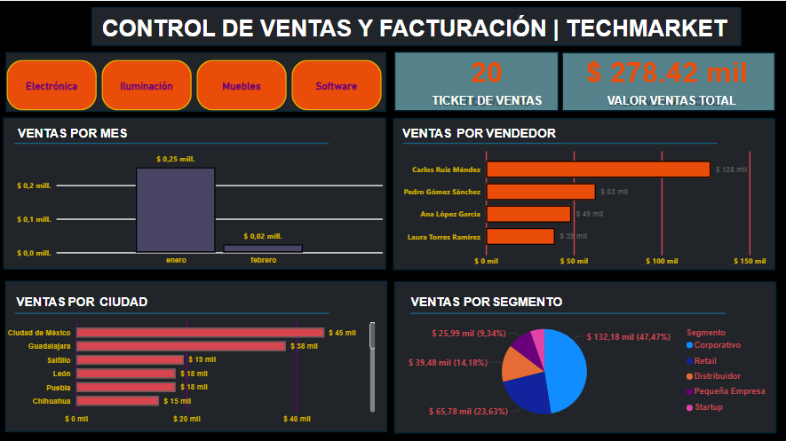

# 📊 Dashboard de Análisis de Ventas y Gestión Comercial - Power BI & Excel

## 📌 Descripción del Proyecto
Este proyecto integrador abarca la modelación de datos relacionales, la limpieza y transformación mediante **Power Query**, y la creación de un panel interactivo en **Power BI** enfocado en el análisis comercial y operativo de ventas. Además, incluye la estructura completa de orígenes de datos procesados en **Excel**, integrando consultas relacionales y lógica de negocios.

---

## 🛠️ Herramientas y Tecnologías Utilizadas
* **Power BI Desktop:** Modelado de datos, creación de medidas DAX e iteradores, visualización de datos interactivas y filtros segmentadores.
* **Power Query:** Limpieza, transformación de datos, normalización de campos y estructuración de tablas.
* **Microsoft Excel / VBA:** Origen de datos multitabla (*Clientes, Productos, Ventas, Vendedores, Proveedores*) e integración de funciones avanzadas / automatizaciones.
* **GitHub:** Control de versiones y documentación del proyecto.

---

## 📐 Estructura del Modelo de Datos
El modelo relacional está compuesto por tablas maestras (*Dimensiones*) y de transacciones (*Hechos*), garantizando una arquitectura en estrella optimizada:
1. **Fact_Ventas:** Registro transaccional de ventas y montos.
2. **Dim_Clientes:** Información demográfica y segmentación de clientes.
3. **Dim_Productos:** Catálogo comercial y categorías de productos.
4. **Dim_Vendedor:** Desempeño y asignación de equipo comercial.
5. **Dim_Proveedores:** Datos de cadena de suministro y origen de marcas.

---

## 📈 Métricas e Indicadores Clave (KPIs)
* **Ventas Totales:** Cálculo agregativo del volumen general de facturación.
* **Margen de Ganancia:** Indicador de rentabilidad comercial por categoría y producto.
* **Rendimiento por Vendedor:** Identificación de mejores ejecutivos comerciales y cumplimiento.
* **Análisis Geográfico y Demográfico:** Distribución de clientes y cobertura de mercado.

---

## 👨‍💻 Autor
**Ricardo Corzo**  
*Ingeniero de Sistemas | Analista de Datos & Desarrollo*  
* Bogotá, Colombia
